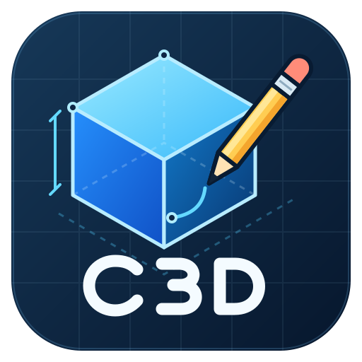
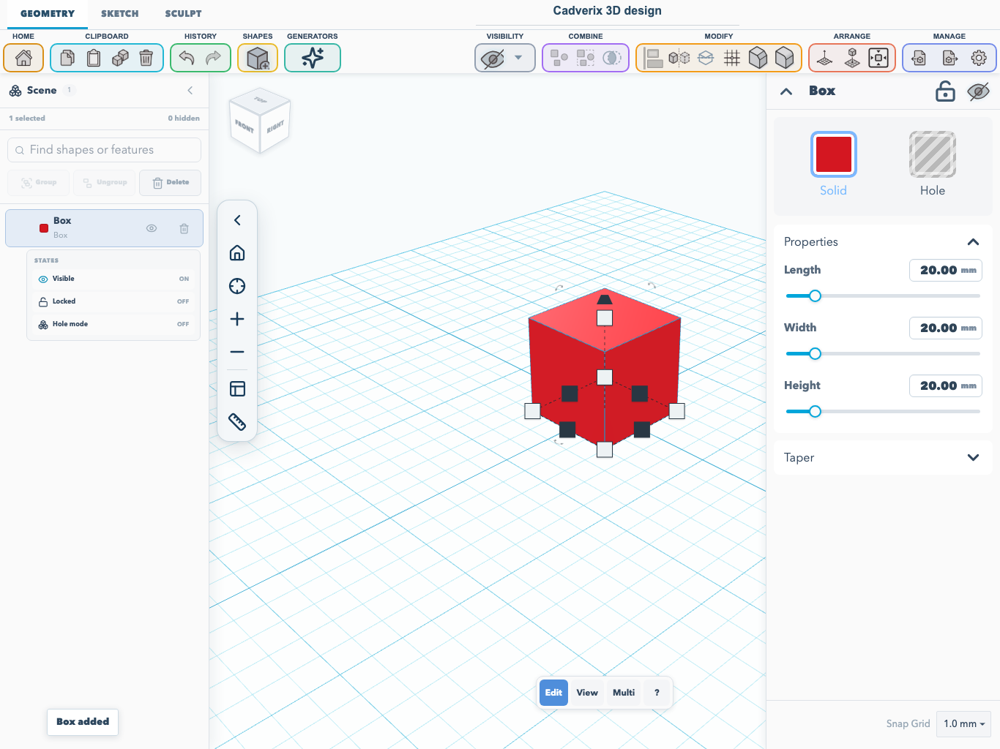
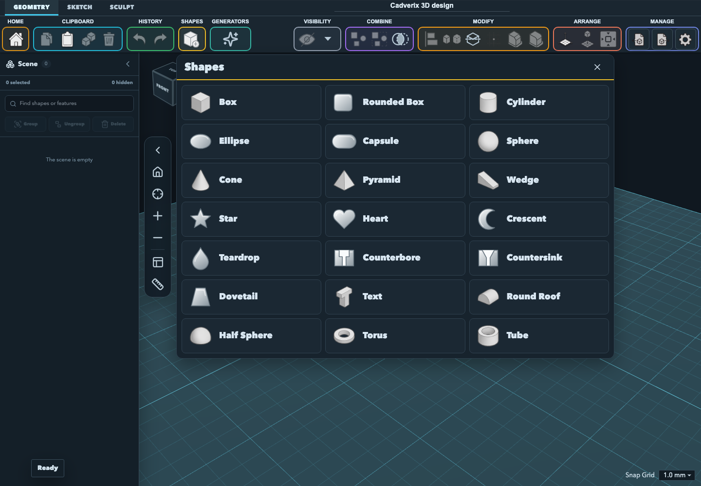
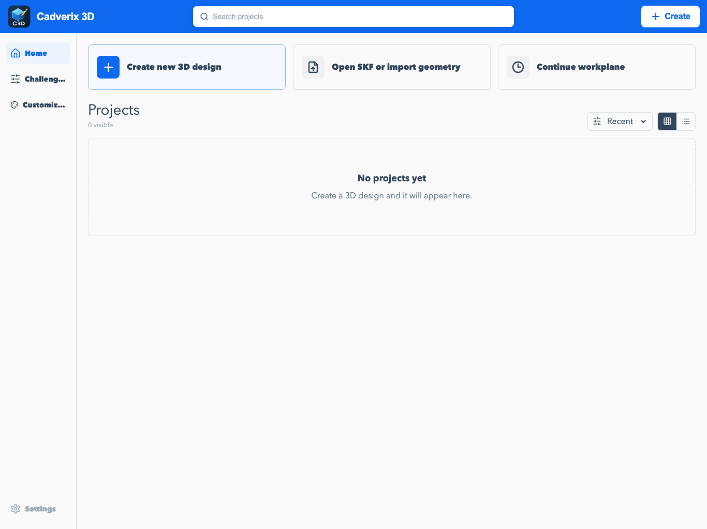

<div align="center">
  <table>
    <tr>
      <td width="145" align="center">
        
      </td>
      <td>
        <h1 align="right">Cadverix 3D</h1>
        <h3 align="right">A local-first 3D design editor that runs in your browser.</h3>
        <p align="right">
          Sketch profiles, build shapes, sculpt meshes, cut holes, and exchange models without accounts, cloud lock-in, or heavyweight CAD setup.
        </p>
      </td>
    </tr>
  </table>

  <p>
    <a href="LICENSE"></a>
    <a href="https://github.com/WC3D/SketchForge-3D/stargazers"></a>
    <a href="https://github.com/sponsors/Formsmith746"></a>
    
    
    <a href="docs/MOBILE_ALPHA.md"></a>
  </p>
</div>



## Why Cadverix 3D

Cadverix 3D is a lightweight CAD-style workspace for people who want to sketch, cut, and export 3D models quickly.

It is built for the satisfying loop: drop a shape, resize it, rotate it, make another shape a hole, group the result, import an STL if primitives are not enough, and export the finished model.

No login. Private projects autosave locally in your browser, with optional shared project storage on your own Docker server. No heavyweight CAD install just to make a useful part.

## What It Does

- **2D Sketching & Parametric Profiles** - draw parametric lines, Bézier curves, three-point arcs (start, end, then bulge), circles, rectangles, polygons, and text with constraints, distance dimensions, region selections, and revolve/extrude/sweep operations.
- **Local-first projects** - designs live in browser storage with generated project thumbnails.
- **Editable SKF project packages** - back up and transfer projects with their editable objects, imported assets, and available undo/redo history; optionally save to a shared Docker library. Compatible Layerling `.lyl` files can also be opened and are converted to SKF when saved.
- **Real 3D workplane** - grid, camera controls, snap settings, transform handles, outlines, and inspector controls.
- **Associative construction planes** - create offset, angled, flipped, face-attached, and midplanes for sketches away from the base workplane.
- **Primitive shape library** - boxes, cylinders, spheres, cones, pyramids, wedges, text, roofs, half spheres, torus shapes, tubes, and more.
- **Solid and hole workflow** - turn shapes into cutters and group them into final geometry.
- **Boolean Intersection** - keep only the geometry where selected solid and hole shapes overlap.
- **Reversible edge tools** - chamfer and fillet selected CAD edges, with history controls for removing applied edge features.
- **Faceted mesh rim treatments** - dedicated chamfer and rounded Fillet paths for supported complete, convex, horizontal outer rims on imported meshes, with CAD validation and retained B-Rep geometry.
- **Rotated solid edge treatment** - chamfer and fillet preserve analytic box topology after one-, two-, or three-axis rotations.
- **Mesh sculpting** - Add, Subtract, and Smooth brushes with adjustable radius and strength, local remeshing, and undoable strokes processed in a background worker.
- **2D CAD drawings** - a Drawing tab beside Sculpt, with ISO A0–A4 and ANSI A–E sheets, movable orthographic/isometric model views, custom rotations and scales, dimensions, paper geometry, notes, SVG export, and Print/PDF.
- **Scene overview** - search shapes and features, inspect groups, control visibility, locking, and hole state, and toggle or remove supported features.
- **Placement and navigation tools** - align, mirror, center selections on the workplane, focus the camera on a selection, and move objects using the snap grid.
- **3MF, STL, STEP, and SVG import** - bring outside models and vector profiles into the same workspace as primitives.
- **3MF, STL, OBJ, STEP, and SVG workflows** - export selected objects or the whole scene, including print-ready 3MF packages and exact STEP/B-Rep geometry where available.
- **Mobile support (alpha)** - touch-first geometry, sketch, and sculpt controls with compact phone/tablet layouts and pen input support.
- **Fast browser stack** - Next.js, React, TypeScript, Three.js, and Manifold/CSG geometry tooling.

### Browser modeling and project storage

Cadverix includes cross-file 3MF assembly import, fractional viewport/sketch
measurements, printer build-volume presets, XYZ/circular patterns, lay-flat,
face pivots, browser-worker shelling, and sketch clipboard/corner tools. Open
**Geometry → Modify → Modeling tools** for patterns, face tools, and shelling.

**Storage & backups** on the dashboard provides local recovery snapshots and
downloadable SKF backups in every deployment. Configured Node/Docker instances
and the desktop app also offer filesystem folders and retained file versions.
See [Modeling and storage](docs/MODELING_AND_STORAGE.md) for controls, supported
geometry, retention limits, and deployment-specific capabilities.

### 2D CAD drawing sheets

Open **Drawing** beside **Sculpt**, choose an ISO or ANSI paper template, and add views of individual objects, a selection, or the visible assembly. Use **3 views** for a first-/third-angle layout, or place and rotate views individually. Add horizontal, vertical, aligned, angular, radius, and diameter measurements, plus lines, rectangles, circles, and notes.

Sheets autosave with the project and can be exported as SVG or printed to PDF at physical paper size. See the [Drawing workspace guide](docs/DRAWING_WORKSPACE.md) for measurement behavior, source-model updates, and file compatibility.

### Color-coded tools and the Shapes palette

Toolbar groups use distinct colored outlines for Clipboard, History, Shapes, Generators, Visibility, Combine, Modify, Arrange, Manage, and Home. Labels and tooltips remain visible alongside the colors.

The **Shapes** menu opens a wide, three-column catalog with larger icons and readable labels. Generator entries—Gear, Screw, Washer, Nut, Spring, Honeycomb, and Bent Tube—appear only in **Generators**, keeping the menus separate. On smaller screens each palette switches to two columns, or one on very narrow phones, and scrolls within the visible viewport with a sticky header and close button.



### Camera and placement shortcuts

- Press **O** to switch between perspective and orthographic projection while preserving view direction and framing.
- Press **Shift+F** to focus the camera on the selection.
- Use **Center on workplane** to center the selected objects on the build plate without changing their elevation.
- Press **R** to rotate selected objects by 45 degrees around the active workplane normal, or **Shift+R** for 22.5 degrees.
- Arrow-key movement follows the snap grid; **Ctrl/Cmd+arrow** changes elevation. Holding a movement key produces one undo step when released.
- Duplicating an object keeps it at the source object's exact position, ready to move or edit.

### Fillet and chamfer on imported rims

Select the imported object, open **Fillet** or **Chamfer**, enable **Select tangent chains**, and click or tap the rim. A densely faceted STL rim can contain many short edges; select the complete rim to use the dedicated planar-rim path. Chamfer uses a tapered cut, while Fillet uses circular profiles that follow the adjacent wall slopes. These paths apply to supported convex, horizontal outer rims; other selections use the normal CAD edge builder.

Mobile **Multi** mode controls object selection and is hidden during edge treatment, so it no longer overrides tangent-chain selection. Kernel memory faults stop further retries and replace the worker. Diagnostic details are logged under **`[Cadverix 3D CAD]`** in the browser console.

See [CAD edge tools](docs/CAD_EDGE_TOOLS.md) for supported geometry, recovery, and regression-test instructions.

### Sculpting and scene management

Select one unlocked solid and open **Sculpt**. Choose **Add**, **Subtract**, or **Smooth**, adjust the brush radius and strength, then drag over the surface. Each completed drag is one undoable stroke. Sculpting converts the object to a mesh and retains its source for reversible sculpt changes.

The **Scene** sidebar provides a searchable object/group overview. Selected objects expose visibility, lock, and hole controls, plus supported feature controls for fillet/chamfer, sculpt changes, sketch output, and group/intersection results.

### Project files and autosave

Private projects autosave in IndexedDB for the browser and site address you use. Export a **`.skf`** package to back up an editable project or move it between browsers, computers, and mobile devices. Opening a package creates a new local project. Geometry exports such as STL and 3MF are separate from editable project backups.

Modeling-only saves use **SKF format 2**, with deduplicated mesh/B-Rep/image assets and compact binary CAD display edges shared across history states. Projects containing a drawing sheet use **format 3 / minimum reader 3**, preserving sheet templates, view definitions, and measurements. The reader accepts formats 1, 2, and 3, legacy JSON projects, and earlier JSON display-edge assets; drawing projects require a drawing-capable reader.

See the [SKF project format documentation](docs/SKF_PROJECT_FORMAT.md) for package structure, history options, and compatibility details.

### Construction planes

Open **Geometry > Workplane** to choose the active sketch plane or create a persistent construction plane:

- **Offset** creates an XY, XZ, or YZ plane with an optional normal offset, local-X angle, and flipped normal.
- **Angle** rotates a new associative plane from the base XZ plane or an existing construction plane.
- **Mid-plane** creates a plane halfway between two parallel source planes, with an optional normal offset.
- **Associative face plane** creates a plane from a model face that follows the source object's movement, rotation, and resizing.

New angle and midplanes remain linked to their source planes. Select any listed plane as the active sketch plane before starting an extrude, revolve, or sweep sketch.

## Mobile Support — Alpha

Cadverix 3D includes **alpha mobile support** in the browser, with touch-first controls for phones and tablets. No separate mobile app or account is required. Tool ribbons scroll horizontally, menus stay within the viewport, touch targets are larger, and compact layouts use collapsible scene and shape-property panels.

| Touch input | Behavior |
| --- | --- |
| Tap in Edit mode | Select an object; tap empty space to clear selection |
| Drag an already-selected object | Move it in one undoable action |
| Drag empty space or an unselected object | Orbit the 3D camera |
| Two-finger drag / pinch | Pan / zoom |
| View (Navigate) | Navigate with one finger without editing; pan in sketch view |
| Multi | Toggle objects in or out of the selection by tapping |
| Edit in Sculpt / Draw in Sketch | Brush the mesh / use the active sketch tool |
| ? button | Show touch gesture help |
| Top toolbar undo/redo | Access history without a keyboard |

Pen input uses the active tool, and touch contacts are ignored while a pen is down. A second finger switches touch interaction to navigation; finish resize/rotate handle adjustments before starting a camera gesture.

Wheel/trackpad zoom also works over selection handles. Workspace settings synchronize by value, and saved defaults seed the workspace once, preventing theme/snap update loops and preserving later user choices.

**Status:** this is an early alpha/MVP. Automated Chromium/WebKit menu checks and Chromium touch/pen checks are available, but physical-device validation is still needed, especially for iOS Safari, Android Chrome, styluses, on-screen numeric entry, and large meshes.

To try it, open your Docker server's LAN address on a device on the same network, or start a development server with `npm run dev -- --hostname 0.0.0.0 --port 3001` and visit `http://<computer-LAN-IP>:3001`. Use `.skf` export/import to transfer editable projects. STL or 3MF exports can be downloaded and opened in a slicer; the alpha does not include direct slicer API integration.

See [Mobile Alpha](docs/MOBILE_ALPHA.md) for setup, gesture details, and device-testing instructions.

## Demo



### 2D Sketching & Revolve Workflow

Draw profiles in Sketch mode, then extrude, revolve, or sweep them into 3D geometry. See [CAD edge tools](docs/CAD_EDGE_TOOLS.md) for finishing imported rims and solids.

## Getting Started

Run Cadverix 3D in your browser from a local server, or install a desktop release. Docker is the recommended self-hosted option.

| Path | Best for | Difficulty |
| --- | --- | --- |
| Desktop release | Windows, macOS, and Linux desktop use | Easy |
| Docker / FabLab server | Teachers, classrooms, shared computers, local network hosting | Recommended |
| Local development | Developers who want to edit the code | Medium |

Cadverix 3D is local-first. Private projects stay in each user's browser storage, and model exports download through the browser. Docker users can explicitly save `.skf` files to their own server's shared project library. Cadverix 3D does not upload models to a cloud service.

## Desktop Releases

Desktop packaging supports a Windows x64 installer, macOS Intel/Apple Silicon DMGs, and Linux AppImages. Download the matching asset from [GitHub Releases](https://github.com/WC3D/SketchForge-3D/releases).

- **Windows:** run the `Cadverix 3D-Setup-…-x64.exe` installer.
- **Linux:** mark the `.AppImage` executable in your file manager's permissions, then launch it.
- **macOS:** follow the DMG instructions below.

### macOS

GitHub releases include macOS DMG files for Intel (`x64`) and Apple Silicon (`arm64`) Macs. Choose the file that matches your Mac.

1. Open the downloaded DMG file.
2. Drag `Cadverix 3D.app` to the `Applications` folder.
3. Eject the DMG file.
4. Control-click `Cadverix 3D.app` in `Applications`.
5. Select **Open**, then select **Open** again.

Unsigned releases have `-unsigned` in the file name. macOS shows a Gatekeeper warning for these releases. If macOS does not show the **Open** option, run this command in Terminal:

```bash
xattr -dr com.apple.quarantine "/Applications/Cadverix 3D.app"
open "/Applications/Cadverix 3D.app"
```

Do not open the app from Safari's Downloads folder or directly from the mounted DMG. Copy it to `Applications` first.

### macOS Virtual Machines

Some macOS virtual machines do not provide hardware WebGL. Launch Cadverix 3D with software WebGL in that case:

```bash
"/Applications/Cadverix 3D.app/Contents/MacOS/Cadverix 3D" \
  --use-angle=swiftshader \
  --enable-unsafe-swiftshader
```

## Download the Project

If you already know Git:

```bash
git clone https://github.com/WC3D/SketchForge-3D.git cadverix-3d
cd cadverix-3d
```

If you do not know Git yet:

1. Open the GitHub page for this repository.
2. Press the green **Code** button.
3. Press **Download ZIP**.
4. Extract the ZIP somewhere easy to find, such as your Desktop.
5. Open a terminal in the extracted folder.

On Windows, you can open PowerShell in the folder by opening the folder, clicking the address bar, typing `powershell`, and pressing Enter.

## Docker / FabLab Server (Recommended)

Docker is the easiest way to run Cadverix 3D for a classroom, workshop, or FabLab. It packages the build tools, Next.js server, health check, persistent shared-project storage, and restart behavior together.

### What You Need

- Docker Desktop on Windows or macOS, or Docker Engine on Linux
- Docker Compose, which is included with modern Docker Desktop
- This repository downloaded on the server computer

If `docker` is not recognized, install Docker Desktop and open it once before running the commands.

### Start Cadverix 3D

#### Compose (Build images locally)

From the Cadverix 3D project folder, run:

```bash
docker compose -f deploy/docker/compose.yaml up --build -d
```

The first start can take a few minutes because Docker builds the app.

#### Compose (Prebuilt)

From the Cadverix 3D project folder or with the downloaded `deploy/docker/compose-ghcr.yaml`, run:

```bash
docker compose -f deploy/docker/compose-ghcr.yaml up -d
```

#### Standalone (Prebuilt)

```bash
docker run -d --name cadverix-3d --restart unless-stopped \
  -p 3000:3000 \
  -e CADVERIX_SHARED_PROJECTS_DIR=/data/projects \
  -v sketchforge-shared-projects:/data/projects \
  ghcr.io/wc3d/sketchforge-3d:latest
```

After running, open this on the same computer:

```text
http://127.0.0.1:3000/
```

If that works, Cadverix 3D is running.

The container listens on port `3000`. It also accepts connections on port `80` for backward compatibility with older UnRAID templates and forwards them to the same server. New Docker and UnRAID configurations should use container port `3000`.

### Shared Docker Projects

Docker deployments include a shared `.skf` project library. Private projects still autosave in each user's browser. The **Shared** dashboard section lists files stored in `/data/projects`, and **Export → SKF → Save to shared** writes the current project there. Revision-matched PNG previews are stored beside the library in `/data/projects/.thumbnails` and appear on shared project cards.

Compose uses the persistent `sketchforge-shared-projects` volume by default. This existing volume name and the `sketchforge` Compose service key preserve installations across the rename. To use a directory on the Docker host instead, set `CADVERIX_SHARED_PROJECTS_VOLUME` before starting Compose:

Windows PowerShell:

```powershell
$env:CADVERIX_SHARED_PROJECTS_VOLUME = "C:/Cadverix3D/shared-projects"
docker compose -f deploy/docker/compose.yaml up --build -d
```

Linux or macOS:

```bash
CADVERIX_SHARED_PROJECTS_VOLUME=/srv/cadverix-projects docker compose -f deploy/docker/compose.yaml up --build -d
```

Opening a shared file creates a private local working copy. Saving back checks the server revision first; if another user has changed the file, Cadverix 3D refuses to overwrite it and asks the user to reload or save with another name. This is shared file storage, not simultaneous live editing.

### Let Other Computers Join

Other computers on the same Wi-Fi or LAN need the server computer's local IP address.

On Windows PowerShell, run:

```powershell
ipconfig
```

Look for the `IPv4 Address`, for example:

```text
192.168.1.25
```

Then other computers can open:

```text
http://192.168.1.25:3000/
```

Use your own IP address, not the example one.

### Use a Different Port

If port `3000` is already being used, choose another port such as `8080`.

Windows PowerShell:

```powershell
$env:CADVERIX_PORT = "8080"
docker compose -f deploy/docker/compose.yaml up --build -d
```

Linux or macOS:

```bash
CADVERIX_PORT=8080 docker compose -f deploy/docker/compose.yaml up --build -d
```

Then open:

```text
http://127.0.0.1:8080/
```

### Stop Cadverix 3D

```bash
docker compose -f deploy/docker/compose.yaml down
```

### Update Cadverix 3D Later

The home dashboard's **Settings** panel checks the official version and displays an update prompt when a newer version is available. It never installs an update automatically. Choosing **Not now** dismisses only that version, so a later release will be offered again.

If you used Git, update the existing checkout in place. You do not need to remove or download the repository again:

```bash
git pull
docker compose -f deploy/docker/compose.yaml up --build -d
```

If you use the prebuilt GHCR Compose file:

```bash
docker compose -f deploy/docker/compose-ghcr.yaml pull sketchforge
docker compose -f deploy/docker/compose-ghcr.yaml up -d --no-deps sketchforge
```

If you downloaded the ZIP, download the newest ZIP, extract it, and run:

```bash
docker compose -f deploy/docker/compose.yaml up --build -d
```

Application updates do not clear private projects stored in the browser. Docker shared projects remain in the existing `sketchforge-shared-projects` volume or the host directory configured with `CADVERIX_SHARED_PROJECTS_VOLUME`. Never add `--volumes` or `-v` to an update command.

For an administrator-managed one-click installation, configure all of the following server variables:

- `CADVERIX_UPDATE_TRIGGER_URL`: an internal HTTPS endpoint that pulls/recreates only the Cadverix 3D application while retaining its existing project volume.
- `CADVERIX_UPDATE_ADMIN_KEY`: the key the administrator must enter in the confirmation dialog.
- `CADVERIX_UPDATE_TRIGGER_TOKEN` (optional): a bearer token Cadverix 3D sends only to the internal update service.

Without an administrator-managed trigger, the confirmation opens these safe update instructions instead of granting the web container access to the Docker socket.

### Docker Troubleshooting

- **`docker` is not recognized**: install Docker Desktop, open it, and try again.
- **Docker says the daemon is not running**: Docker Desktop is closed or still starting.
- **Port already in use**: use another port, for example `8080`.
- **Other computers cannot connect**: check that they are on the same network and that the server firewall allows the chosen port.
- **The page opens but old files appear**: stop and rebuild with `docker compose -f deploy/docker/compose.yaml down`, then `docker compose -f deploy/docker/compose.yaml up --build -d`.

If you already have Node.js installed, the repository also includes shortcuts:

```bash
npm run docker:up
npm run docker:down
```

## Local Development

Use this path if you want to edit Cadverix 3D's code.

### What You Need

- Node.js 24 or newer (Node 24 LTS recommended; required by `brepjs`)
- npm, included with Node.js

Check your versions:

```bash
node -v
npm -v
```

If those commands do not work, install Node.js from the official Node.js website and reopen your terminal.

### Install and Run

From the Cadverix 3D project folder:

```bash
npm install
npm run dev
```

Installation automatically applies the compatibility patches in [`patches/`](patches/README.md), including the updated BVH option used by the CSG dependency. Docker builds apply the same patches.

If you use nvm, first run `nvm install` and `nvm use` in the project folder. The included `.nvmrc` selects Node 24. Older Node versions report an `EBADENGINE` warning for `brepjs`.

Open:

```text
http://127.0.0.1:3000/
```

Leave the terminal open while you use the app. To stop the development server, press `Ctrl+C` in the terminal.

The **Save to folder** setting is limited to existing folders under your user `Downloads` directory. To use a different root, set `CADVERIX_LOCAL_DOWNLOAD_ROOT` before starting Cadverix 3D. For example, on macOS or Linux:

```bash
CADVERIX_LOCAL_DOWNLOAD_ROOT=/path/to/exports npm run dev
```

On Windows PowerShell:

```powershell
$env:CADVERIX_LOCAL_DOWNLOAD_ROOT = "C:\path\to\exports"
npm run dev
```

### Useful Developer Commands

Run TypeScript checks:

```bash
npm run typecheck
```

Run tests:

```bash
npm run test
```

Run the mobile browser regression suite (separate from the unit tests):

```bash
npx playwright install chromium webkit
npm run test:mobile
```

The suite uses a server on port 3000 or starts one automatically. See [Mobile Alpha validation](docs/MOBILE_ALPHA.md#validation) for custom server URLs and coverage.

Start the local Cadverix 3D MCP bridge for editor automation:

```bash
npm run mcp:cadverix
```

Create a production build:

```bash
npm run build
```

Build a static export on Windows, macOS, or Linux:

```bash
npm run export
```

Static hosting provides the browser editor; server-backed features such as the shared project library require a server deployment.

Run or package the Electron desktop app:

```bash
npm run desktop:dev
npm run desktop:dist
```

## Documentation

- [Drawing workspace](docs/DRAWING_WORKSPACE.md) — ISO/ANSI sheets, model views, measurements, and SVG/PDF output.
- [User manual](docs/CADVERIX_USER_MANUAL.md) — modeling, sketch tools, import/export, and shortcuts.
- [Rename and compatibility guide](docs/CADVERIX_REBRAND.md) — existing projects, installation identities, configuration aliases, and upstream attribution.
- [Mobile Alpha](docs/MOBILE_ALPHA.md) — touch/pen controls, LAN setup, and validation status.
- [CAD edge tools](docs/CAD_EDGE_TOOLS.md) — imported rim fillets/chamfers, supported geometry, diagnostics, and tests.
- [SKF project format](docs/SKF_PROJECT_FORMAT.md) — editable project packages and reader compatibility.
- [Changelog](docs/CHANGELOG.md) — release notes, including CAD stability and editor fixes in 1.0.12.

## Contributing

Contributions are welcome. Good places to help:

- editor bug fixes
- geometry and boolean test cases
- STL import/export edge cases
- UI polish
- documentation screenshots and videos
- accessibility and performance improvements

Read [.github/CONTRIBUTING.md](.github/CONTRIBUTING.md) before opening a pull request.

## Security

Please do not open public issues for security-sensitive reports. Read [.github/SECURITY.md](.github/SECURITY.md) for the reporting process.

## License

Copyright © 2026 SketchForge contributors.

Cadverix 3D is derived from SketchForge and retains its contributors' copyright notices. Cadverix 3D is licensed under the **GNU Affero General Public License v3.0 only** (`AGPL-3.0-only`). If you modify Cadverix 3D and let users interact with the modified version over a network, you must offer those users the corresponding source code under the same license. See [LICENSE](LICENSE).

The application exposes a **Source** link in the dashboard. Operators distributing or hosting a modified build should set `NEXT_PUBLIC_SOURCE_CODE_URL` at build time to the public URL containing that build's complete corresponding source code.

## Cadverix 3D MCP Skill

Cadverix 3D includes a local MCP server for AI clients that support MCP tools. It lets an agent inspect and control a live local editor tab: list open editors, read the scene, create/update/select objects, group/cut/separate parts, list CAD edge ids, apply chamfer or fillet, inspect errors, and capture viewport images.

This is for local development only. Run Cadverix 3D with `npm run dev`; the MCP route is disabled in production builds and Docker/static hosting.

### Start Cadverix 3D for MCP

From the Cadverix 3D project folder:

```bash
npm install
npm run dev
```

Open an editor tab:

```text
http://127.0.0.1:3000/?editor=1
```

The AI client starts the MCP server with:

```bash
node scripts/cadverix-mcp-server.mjs
```

### Codex

The Codex skill is included at:

```text
docs/skills/cadverix-mcp-skill
```

Install it into your Codex skills folder.

Windows PowerShell:

```powershell
New-Item -ItemType Directory -Force "$env:USERPROFILE\.codex\skills" | Out-Null
Copy-Item -Recurse -Force "docs\skills\cadverix-mcp-skill" "$env:USERPROFILE\.codex\skills\cadverix-mcp-skill"
```

macOS or Linux:

```bash
mkdir -p ~/.codex/skills
cp -R docs/skills/cadverix-mcp-skill ~/.codex/skills/
```

Then add an MCP server entry to your Codex config. Use [`docs/mcp/codex-config.example.toml`](docs/mcp/codex-config.example.toml) as the template and replace the script path with the absolute path on your machine. Restart Codex after changing the config.

Once installed, ask Codex:

```text
Use $cadverix-mcp-skill to list my open Cadverix 3D editors and inspect the current scene.
```

### Claude

Claude does not use Codex `SKILL.md` files, but it can use the same Cadverix 3D MCP server. Add the server to Claude Desktop's MCP config using [`docs/mcp/claude-desktop-config.example.json`](docs/mcp/claude-desktop-config.example.json) as the template, replacing the script path with the absolute path on your machine.

After restarting Claude Desktop, ask:

```text
Use the Cadverix 3D MCP tools to list open editors, inspect the scene, and modify the selected object.
```

The main tool names are `cadverix_list_editors`, `cadverix_read_scene`, `cadverix_list_objects`, `cadverix_create_shape`, `cadverix_update_object`, `cadverix_list_edges`, `cadverix_apply_edge_treatment`, and `cadverix_capture_image`.
