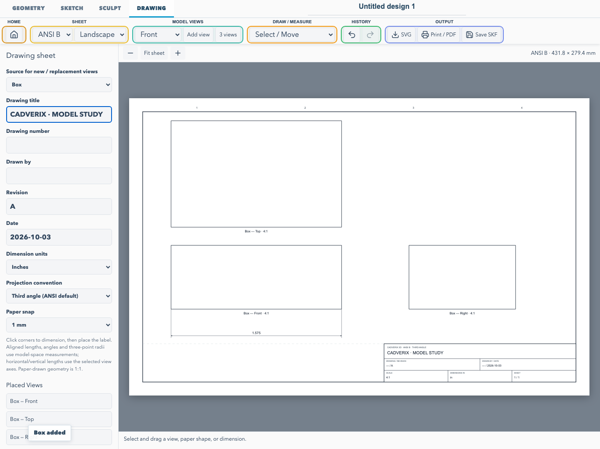

# 2D CAD Drawing workspace

Open **Drawing**, the top tab beside **Sculpt**, to create a technical drawing sheet for the current project. Finish or cancel an active 2D sketch before entering Drawing.

The workspace combines model projections, editable paper geometry, dimensions, notes, and a title block. It stores one sheet per project. Drawing views reference existing objects; moving or deleting a drawing view does not move or delete its 3D source.



## ISO and ANSI templates

Choose a template and landscape/portrait orientation in the Drawing toolbar:

| Template | Landscape size |
| --- | --- |
| ISO A4 | 297 × 210 mm |
| ISO A3 | 420 × 297 mm |
| ISO A2 | 594 × 420 mm |
| ISO A1 | 841 × 594 mm |
| ISO A0 | 1189 × 841 mm |
| ANSI A | 11 × 8.5 in |
| ANSI B | 17 × 11 in |
| ANSI C | 22 × 17 in |
| ANSI D | 34 × 22 in |
| ANSI E | 44 × 34 in |

Templates supply the physical paper size, drawing border, title block, and projection-layout default. ISO defaults to millimeter dimensions and first-angle projection; ANSI defaults to inch dimensions and third-angle projection. Units and projection convention can also be selected independently.

Fill in **Drawing title**, **Drawing number**, **Drawn by**, **Revision**, and **Date** in Drawing properties. The title block reports units and view scale; mixed scales are marked as shown. The bottom band is reserved for the title block and scale information.

## Place models at different angles

1. Choose the source: one solid, the solids selected in Geometry, or all currently visible solids.
2. Choose **Front**, **Top**, **Right**, **Left**, **Back**, **Bottom**, or **Isometric**.
3. Press **Add view**, then drag the view into position on the sheet.
4. Select a placed view to edit its label, paper position, scale, and X/Y/Z rotation angles. **Fit view to drawing area** chooses a suitable scale and centers it.

**3 views** places Front, Top, and Right views together. In third-angle layout, Top is above Front and Right is to its right. In first-angle layout, Top is below Front and Right is to its left. Changing the convention rearranges a matching three-view set; custom layouts remain user-arranged.

Paper changes reposition view centers proportionally without altering their model scale. Each view can show or hide dashed hidden edges. Model projections are generated from tessellated geometry, including sharp edges and silhouettes; hidden-line classification uses mesh visibility tests.

Views keep their selected source object IDs. Use **Use selected source for this view** to replace a source or include additional objects. Current limits are 24 placed views, 100,000 source triangles and 12,000 candidate edges per view.

These are ISO/ANSI paper templates with projection-layout defaults, rather than full drafting-standards certification. Hidden-line output is mesh-based and approximate. This release supports one sheet per project; section/detail views, GD&T, tolerance annotations, and DXF/DWG output are not included.

## Draw directly on the sheet

Choose a tool from **Draw / Measure**:

- **Line:** click two endpoints.
- **Rectangle:** click opposite corners.
- **Circle:** click the center, then a radius point.
- **Note:** enter the new-note text in properties, then click to place it. Notes support explicit line breaks.

Select a paper entity to move it, set precise coordinates, rotate it, change a circle's radius, or edit note text. Paper geometry is drawn at **1:1**; model views have independent scales. The paper snap setting controls placement of drawn points.

The properties panel lists placed views, paper entities, and dimensions, including items needing review. **Delete selected drawing item** or the Delete key removes only the selected drawing item and any annotations attached to a deleted source item.

## Add measurements

| Tool | Placement sequence | Value |
| --- | --- | --- |
| Horizontal / Vertical | Pick two endpoints or corners, then place the dimension | Distance along the view's projected X/Y axis |
| Aligned | Pick two endpoints or corners, then place the dimension | True model-space distance for model views |
| Angle | Pick first ray point, vertex, second ray point, then place the arc | Angle between the model-space vectors |
| Radius / Diameter on a drawn circle | Click the circle, then place the leader | The circle's radius/diameter |
| Radius / Diameter on a model | Pick three points on a circular feature, then place the leader | Circle through those three model-space points |

Click near a corner to use its highlighted snap point. Measurements within a model view must use points from that same view. Paper-entity dimensions may connect different paper shapes. Radius/diameter measurement from three points assumes a circular feature; it is not automatic curve recognition.

Moving or scaling a view moves its annotations without scaling the measured model values. Horizontal and vertical measurements follow the view axes when its angle changes. Aligned lengths, angles, and radii use the original 3D coordinates. Labels display two decimals in millimeters, three in inches, and one for angular degrees.

Drag a dimension label or edit its offset in properties. Radius/diameter leaders can be positioned freely. Escape or **Cancel placement** abandons an unfinished operation. Drawing has its own Undo/Redo buttons and Ctrl/Cmd+Z history, separate from geometry history; that undo history is session-local.

## Model changes and annotation review

Views update from their source geometry. If that geometry changes, previously attached model dimensions are marked **Dimensions need review** and hidden. Use **Clear stale dimensions** on the affected view, then add updated measurements. Missing sources, stale or collapsed dimensions, and content outside the drawing area prevent normal SVG export and Print/PDF until corrected.

The change detector follows geometry rather than object names or colors. Changing a view's paper position, scale, or orientation does not by itself mark its source geometry stale.

## Save, SVG, and PDF

- Drawing edits autosave with an existing project. **Save SKF** saves the complete editable project, including its sheet and 3D sources. Use SKF for an editable drawing-sheet round trip.
- **SVG** exports a vector sheet with physical millimeter width/height, title block, model views and dimensions. Selection handles and unfinished previews are removed.
- **Print / PDF** opens the browser print dialog. Choose the matching paper size and **100% / Actual size**; disable browser headers/footers. Use the dialog's Save as PDF destination to create a PDF.

Projects containing a drawing sheet use **SKF format 3 / minimum reader 3** so older applications reject them instead of silently discarding the drawing. Modeling-only projects continue to use format 2, and the current reader still opens format 1 and 2 projects.

## Phone and tablet controls

Tap to place geometry and measurement points; drag to move a view or drawing item. Pinch to zoom and use two fingers to pan the sheet. The toolbar scrolls horizontally. On phones, **Drawing properties** opens a compact scrollable panel; toggle it closed for an unobstructed sheet. **Fit sheet** restores the overview.

## Validation

```bash
npm test -- tests/unit/drawingSheet.test.ts tests/unit/drawingPersistence.test.ts
npm run test:mobile -- drawingWorkspace.spec.ts
```

Coverage includes paper dimensions, first/third-angle placement, projected bounds, silhouettes and hidden edges, scale-independent dimensions, numeric edits, stale-dimension handling, SVG escaping, a single-page physical-size PDF, SKF round trips, drawing history, and phone layout.
